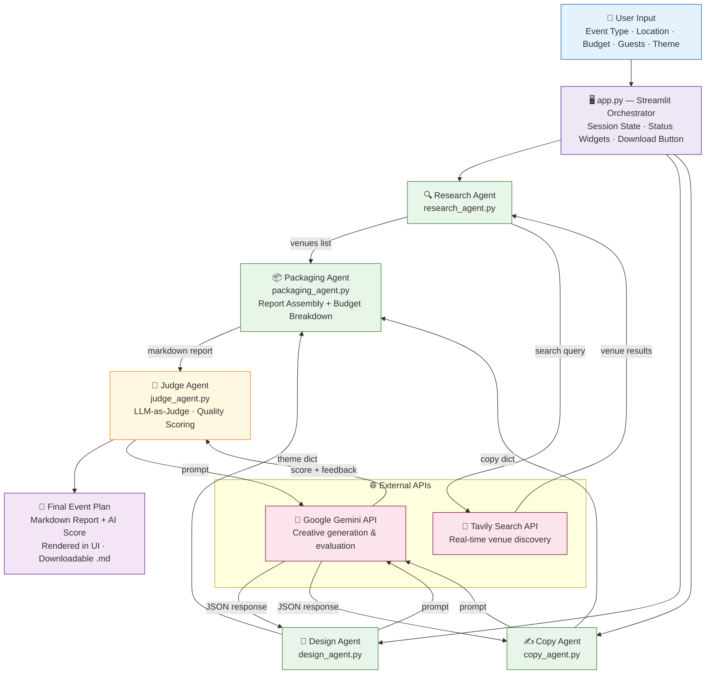
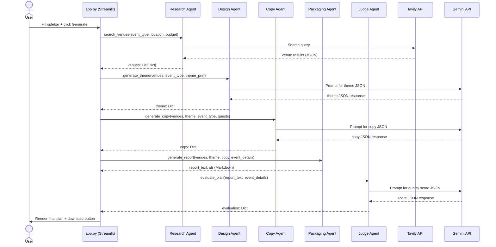

# 🎓 Event Planning Assistant

**An AI-powered multi-agent system that automates college event planning — from venue research to final report — in one click.**

[](https://python.org)
[](https://streamlit.io)
[](https://ai.google.dev)
[](https://tavily.com)
[](LICENSE)
[](https://railway.app)

---

## 📋 Table of Contents

- [Overview](#-overview)
- [Live Demo](#-live-demo)
- [Features](#-features)
- [Architecture & Workflow](#-architecture--workflow)
- [Tech Stack](#-tech-stack)
- [Project Structure](#-project-structure)
- [Agent Details](#-agent-details)
- [API Integration](#-api-integration)
- [Installation & Setup](#-installation--setup)
- [Environment Variables](#-environment-variables)
- [Running the App](#-running-the-app)
- [How to Use](#-how-to-use)
- [Output Format](#-output-format)
- [Deployment on Railway](#-deployment-on-railway)
- [Troubleshooting](#-troubleshooting)
- [Contributing](#-contributing)
- [License](#-license)

---

## 📖 Overview

College students and event organizers often spend hours juggling multiple tools to plan a single event — searching for venues, writing invitations, designing themes, managing budgets, and creating scripts. **Event Planning Assistant** eliminates that friction entirely.

It uses a **multi-agent AI architecture** where five specialized AI agents collaborate in a pipeline to handle every aspect of event planning automatically:

| Step | Agent | What it Does |
|------|-------|-------------|
| 1 | 🔍 Research Agent | Finds real venues using live web search |
| 2 | 🎨 Design Agent | Generates color palettes, mood, and layout themes |
| 3 | ✍️ Copy Agent | Writes invitations, MC scripts, and social media posts |
| 4 | 📦 Packaging Agent | Assembles everything into a report with budget breakdown |
| 5 | 🧠 Judge Agent | Scores the plan on quality using LLM-as-Judge |

The result is a fully formatted **Markdown report** with an AI quality score, downloadable in one click.

---

## 🌐 Live Demo

The app is deployed live on **Railway** and accessible publicly.

> Visit the app → https://event-planning-assistant-production.up.railway.app/

---

## ✨ Features

### Core Features
- ✅ **Real-Time Venue Discovery** — Uses Tavily Search API to find actual venues matching your event type, city, and budget
- ✅ **AI Theme Generation** — Custom color palettes, aesthetic mood keywords, and visual layout suggestions powered by Gemini
- ✅ **Professional Copywriting** — Formal invitations, step-by-step MC scripts, and social media post drafts — all generated by Gemini
- ✅ **Smart Budget Breakdown** — Automatically allocates total budget across venue, catering, decor, audio/visual, and miscellaneous
- ✅ **LLM-as-Judge Evaluation** — A separate Gemini call scores the final plan on Completeness, Creativity, Budget Adherence, and Clarity (each out of 10)
- ✅ **Downloadable Reports** — Export the complete plan as a `.md` Markdown file
- ✅ **Graceful Fallbacks** — Never crashes; uses realistic mock data when API rate limits or quotas are hit

### Advanced Features
- 🔐 **Secure API Key Management** — All credentials stored in `.env`, loaded via `python-dotenv`
- 🔄 **Streamlit Session State** — Plan data is stored in memory so it persists across UI interactions and reruns
- 📊 **Real-Time Progress Updates** — Live status indicators show which agent is currently running
- 🌐 **Cloud-Deployed** — Hosted on Railway with automatic scaling and a public URL
- 🧪 **Modular Agent Architecture** — Each agent is an independent Python module in `/agents/`, testable in isolation

---

## 🏗️ Architecture & Workflow

### High-Level System Flow



---

### Detailed Agent Pipeline

```mermaid
flowchart LR
    subgraph INPUT["INPUT — Streamlit Sidebar"]
        ET["Event Type"]
        LOC["Location / City"]
        BUD["Budget $$$"]
        GC["Guest Count"]
        TP["Theme Preference"]
    end

    subgraph STEP1["Step 1 — Research Agent"]
        direction TB
        R1["search_venues()\nevent_type, location, budget"]
        R2["Tavily Search API\nquery: venues in city under $budget"]
        R3["List of venue dicts\nname · address · capacity · price"]
        R1 --> R2 --> R3
        R_FB["⚠️ Fallback:\nMock venue list"]
    end

    subgraph STEP2["Step 2 — Design Agent"]
        direction TB
        D1["generate_theme()\nvenues, event_type, theme_pref"]
        D2["Gemini API\nPrompt → JSON theme"]
        D3["theme dict\nname · colors · mood · layout"]
        D1 --> D2 --> D3
        D_FB["⚠️ Fallback:\nDefault modern theme"]
    end

    subgraph STEP3["Step 3 — Copy Agent"]
        direction TB
        C1["generate_copy()\nvenues, theme, event_type, guests"]
        C2["Gemini API\nPrompt → JSON copy"]
        C3["copy dict\ninvitation · mc_script · posts"]
        C1 --> C2 --> C3
        C_FB["⚠️ Fallback:\nTemplate copy text"]
    end

    subgraph STEP4["Step 4 — Packaging Agent"]
        direction TB
        P1["generate_report()\nAll agent outputs + event_details"]
        P2["Pure Python\nNo API call"]
        P3["Budget split\nVenue 40% · Catering 30%\nDecor 15% · AV 10% · Misc 5%"]
        P4["Markdown report string"]
        P1 --> P2 --> P3 --> P4
    end

    subgraph STEP5["Step 5 — Judge Agent (LLM-as-Judge)"]
        direction TB
        J1["evaluate_plan()\nreport_text, event_details"]
        J2["Gemini API\nPrompt → JSON score"]
        J3["Score dict\noverall · completeness\ncreativity · clarity"]
        J1 --> J2 --> J3
        J_FB["⚠️ Fallback:\nScore 7/10 + generic feedback"]
    end

    subgraph OUTPUT["OUTPUT — Streamlit Main Area"]
        O1["st.markdown(final_report)"]
        O2["st.download_button(.md file)"]
    end

    INPUT --> STEP1 --> STEP2 --> STEP3 --> STEP4 --> STEP5 --> OUTPUT
```



---

### Data Flow Between Agents



---

## 🛠️ Tech Stack

| Component | Technology | Purpose |
|-----------|-----------|---------|
| **Frontend / UI** | [Streamlit](https://streamlit.io) | Web interface, sidebar inputs, status widgets |
| **AI Generation** | [Google Gemini API](https://ai.google.dev) | Theme creation, copywriting, quality evaluation |
| **Web Search** | [Tavily Search API](https://tavily.com) | Real-time venue discovery |
| **Backend Language** | Python 3.10+ | Agent logic, data processing |
| **Config Management** | `python-dotenv` | Secure `.env` loading |
| **Deployment** | [Railway](https://railway.app) | Cloud hosting with public URL |
| **Report Format** | Markdown | Structured, downloadable output |
| **Image Support** | Pillow | Image handling utilities |

---

## 📁 Project Structure

```
event-planning-assistant/
│
├── app.py                    # Main entry point — Streamlit UI + pipeline orchestrator
│
├── agents/                   # All AI agent modules
│   ├── __init__.py
│   ├── research_agent.py     # Venue discovery via Tavily Search API
│   ├── design_agent.py       # Theme/color palette generation via Gemini
│   ├── copy_agent.py         # Invitation, MC script, social posts via Gemini
│   ├── packaging_agent.py    # Report assembly + budget calculation (pure Python)
│   └── judge_agent.py        # LLM-as-Judge quality evaluation via Gemini
│
├── .env                      # API keys (NOT committed to git — see .gitignore)
├── .gitignore                # Excludes .env, venv/, __pycache__/, etc.
├── .railwayignore            # Excludes venv/ from Railway deployment
├── requirements.txt          # Python dependencies
├── runtime.txt               # Python version pin for Railway (e.g. python-3.10.13)
│
├── specs.md                  # Agent-by-agent specification document
├── problem_statement.md      # Original problem statement
│
├── list_models.py            # Utility: lists available Gemini models
├── test_connection.py        # Utility: tests API key connectivity
├── test_pipeline.py          # Utility: end-to-end pipeline test without UI
│
└── venv/                     # Local virtual environment (ignored in git/Railway)
```

---

## 🤖 Agent Details

### 1. 🔍 Research Agent (`agents/research_agent.py`)

**Purpose:** Finds real venue options for the event.

**How it works:**
- Calls the **Tavily Search API** with a query like `"event venues for College Tech Fest in Austin TX under $3000"`
- Parses returned web results and extracts venue names, addresses, estimated capacities, and pricing
- Returns a **Python list of venue dictionaries**

**Inputs:**
```python
search_venues(event_type: str, location: str, budget: int) → List[Dict]
```

**Output example:**
```json
[
  { "name": "Austin Convention Center", "address": "500 E Cesar Chavez St", "capacity": 300, "price_estimate": "$2500" },
  { "name": "The Blanton Museum", "address": "200 E MLK Jr Blvd", "capacity": 150, "price_estimate": "$1800" }
]
```

**Fallback:** Returns 3 hardcoded mock venues if Tavily quota is exceeded or key is missing.

---

### 2. 🎨 Design Agent (`agents/design_agent.py`)

**Purpose:** Generates a visual theme for the event.

**How it works:**
- Sends a structured prompt to **Google Gemini API** asking for a JSON-formatted theme
- Includes venue context and user's theme preference (modern, cyberpunk, rustic, elegant)
- Parses JSON from the response

**Inputs:**
```python
generate_theme(venues: List[Dict], event_type: str, theme_pref: str) → Dict
```

**Output example:**
```json
{
  "theme_name": "NeonFuture",
  "color_palette": ["#0D0D0D", "#00FFFF", "#FF00FF", "#1A1A2E", "#E0E0E0"],
  "mood_keywords": ["futuristic", "energetic", "bold", "immersive"],
  "layout_suggestion": "Dark ambient lighting with neon accent strips along walls, circular seating pods"
}
```

**Fallback:** Returns a default "Modern Blue" theme dictionary.

---

### 3. ✍️ Copy Agent (`agents/copy_agent.py`)

**Purpose:** Writes all event-related text content.

**How it works:**
- Sends a structured prompt to **Google Gemini API** with event context, theme, and guest count
- Requests a JSON object with three content sections
- Parses and returns structured copy

**Inputs:**
```python
generate_copy(venues: List[Dict], theme: Dict, event_type: str, guest_count: int) → Dict
```

**Output example:**
```json
{
  "invitation_text": "You are cordially invited to TechFest 2025...",
  "mc_script": "Good evening, ladies and gentlemen! Welcome to...",
  "social_media_posts": [
    "🎉 TechFest 2025 is here! Join us for...",
    "🚀 Innovation meets creativity at...",
    "📢 Last call for registrations! Don't miss..."
  ]
}
```

**Fallback:** Returns pre-written template text for all three sections.

---

### 4. 📦 Packaging Agent (`agents/packaging_agent.py`)

**Purpose:** Assembles the final event plan report.

**How it works:**
- Takes all outputs from Agents 1–3 plus the original event details
- Uses **pure Python string formatting** (no external API call)
- Calculates a detailed budget breakdown using percentage allocation:
  - Venue: 40% of total budget
  - Catering: 30%
  - Decoration: 15%
  - Audio/Visual: 10%
  - Miscellaneous: 5%
- Formats everything into a structured Markdown document

**Inputs:**
```python
generate_report(research_data: Dict, theme: Dict, copy: Dict, event_details: Dict) → str
```

**Output:** A complete Markdown string with sections for Overview, Venues, Theme, Budget, Invitation, MC Script, and Social Posts.

---

### 5. 🧠 Judge Agent (`agents/judge_agent.py`) — LLM-as-Judge

**Purpose:** Evaluates the quality of the generated plan.

**How it works:**
- Sends the complete Markdown report to **Google Gemini API** along with the original event requirements
- Uses a carefully crafted prompt to produce a structured JSON evaluation
- Scores are numerical (1–10) across four dimensions

**Inputs:**
```python
evaluate_plan(report_text: str, event_details: Dict) → Dict
```

**Output example:**
```json
{
  "overall_score": 8,
  "breakdown": {
    "completeness": 9,
    "creativity": 8,
    "budget_adherence": 7,
    "clarity": 8
  },
  "feedback": "The plan is highly detailed with a strong theme. Budget allocation is logical, though venue cost could be optimized. Copy sections are professionally written."
}
```

**Fallback:** Returns a score of 7/10 with generic feedback if evaluation fails.

---

## 🔌 API Integration

### Google Gemini API

Used by: Design Agent, Copy Agent, Judge Agent

```python
from google import genai

client = genai.Client(api_key=os.getenv("GEMINI_API_KEY"))

response = client.models.generate_content(
    model="gemini-2.0-flash",
    contents=your_prompt
)
result_text = response.text
```

The agents parse JSON from the response using `json.loads()`. If the response contains markdown code fences (` ```json `), they are stripped before parsing.

---

### Tavily Search API

Used by: Research Agent

```python
from tavily import TavilyClient

client = TavilyClient(api_key=os.getenv("TAVILY_API_KEY"))

results = client.search(
    query=f"event venues for {event_type} in {location} under ${budget}",
    max_results=5
)
```

Returns web search results that are parsed for venue name, address, and pricing information.

---

## ⚙️ Installation & Setup

### Prerequisites

- Python 3.10 or higher
- Node.js (optional, for tooling only)
- A **Google Gemini API key** → [Get one here](https://aistudio.google.com/app/apikey)
- A **Tavily API key** → [Get one here](https://tavily.com)

---

### Step 1: Clone the Repository

```bash
git clone https://github.com/Parth-191006/event-planning-assistant.git
cd event-planning-assistant
```

---

### Step 2: Create a Virtual Environment

```bash
# Windows (PowerShell)
python -m venv venv
Set-ExecutionPolicy -Scope CurrentUser -ExecutionPolicy RemoteSigned
.\venv\Scripts\Activate.ps1

# macOS / Linux
python3 -m venv venv
source venv/bin/activate
```

---

### Step 3: Install Dependencies

```bash
pip install -r requirements.txt
```

This installs:
```
google-genai>=0.5.0       # Google Gemini API client
tavily-python>=0.3.0      # Tavily search client
python-dotenv>=1.0.0      # .env file loading
streamlit>=1.30.0         # Web UI framework
Pillow>=10.0.0            # Image utilities
markdown2>=2.4.0          # Markdown rendering support
```

---

## 🔑 Environment Variables

Create a `.env` file in the root directory:

```bash
# .env
GEMINI_API_KEY=your_google_gemini_api_key_here
TAVILY_API_KEY=your_tavily_api_key_here
```

> ⚠️ **Never commit your `.env` file to GitHub.** It is already listed in `.gitignore`.

The app loads these automatically via:
```python
from dotenv import load_dotenv
load_dotenv()
```

---

## ▶️ Running the App

```bash
streamlit run app.py
```

The app will open in your browser at `http://localhost:8501`.

---

## 🧪 Testing Utilities

```bash
# Test that your API keys are working
python test_connection.py

# Run the full agent pipeline without the Streamlit UI
python test_pipeline.py

# List available Gemini models
python list_models.py
```

---

## 🖥️ How to Use

1. **Open the app** in your browser after running `streamlit run app.py`
2. **Fill in the sidebar** with your event details:
   - Event Type (College Tech Fest, Cultural Night, Seminar, Alumni Meet, or Other)
   - Location / City (e.g., "Mumbai, India")
   - Budget (slide between $100–$50,000)
   - Expected Guest Count (10–500)
   - Theme Preference (modern, cyberpunk, rustic, elegant)
3. **Click "🚀 Generate Event Plan"**
4. Watch each agent complete in real time via status indicators
5. **View your complete plan** rendered in the main area
6. **Download** as a Markdown file using the download button

---

## 📄 Output Format

The final report is a structured Markdown document with these sections:

```markdown
# Event Plan: College Tech Fest

## 📍 Event Overview
Type | Location | Budget | Guests

## 🏛️ Recommended Venues
(Top 3 venues with names, addresses, capacities, and estimated prices)

## 🎨 Theme
Theme Name | Color Palette | Mood Keywords | Layout Suggestion

## 💰 Budget Breakdown
| Category       | Allocated  |
|----------------|------------|
| Venue          | $1,200     |
| Catering       | $900       |
| Decoration     | $450       |
| Audio/Visual   | $300       |
| Miscellaneous  | $150       |

## ✉️ Invitation
(Full invitation text)

## 🎤 MC Script
(Step-by-step MC script for the event)

## 📱 Social Media Posts
(3 ready-to-post captions)

---

## 🧠 AI Quality Evaluation

Overall Score: 8/10 ⭐

| Criteria         | Score |
|------------------|-------|
| Completeness     | 9/10  |
| Creativity       | 8/10  |
| Budget Adherence | 7/10  |
| Clarity          | 8/10  |

Feedback: (AI-generated qualitative feedback)
```

---

## ☁️ Deployment on Railway

This project is configured for Railway deployment.

### Files Used for Deployment

| File | Purpose |
|------|---------|
| `requirements.txt` | Python packages to install |
| `runtime.txt` | Pins the Python version (e.g., `python-3.10.13`) |
| `.railwayignore` | Excludes `venv/` from being uploaded |
| `.railwayignore.txt` | Backup ignore file |

### Steps to Deploy

1. Push your code to GitHub (ensure `.env` is in `.gitignore`)
2. Create a new project on [Railway](https://railway.app)
3. Connect your GitHub repository
4. Add environment variables in Railway's dashboard:
   - `GEMINI_API_KEY`
   - `TAVILY_API_KEY`
5. Set the start command: `streamlit run app.py --server.port $PORT --server.address 0.0.0.0`
6. Deploy — Railway provides a public URL automatically

---

## 🔧 Troubleshooting

### `streamlit: command not found`
Ensure your virtual environment is activated and dependencies are installed:
```bash
.\venv\Scripts\Activate.ps1   # Windows
pip install -r requirements.txt
```

### `ModuleNotFoundError: No module named 'google.genai'`
```bash
pip install google-genai --upgrade
```

### PowerShell Execution Policy Error (Windows)
```powershell
Set-ExecutionPolicy -Scope CurrentUser -ExecutionPolicy RemoteSigned
```

### API Quota Exceeded
The app uses graceful fallbacks — it will display mock venues and template content instead of crashing. Check your API usage dashboards:
- Gemini: [Google AI Studio](https://aistudio.google.com)
- Tavily: [Tavily Dashboard](https://app.tavily.com)

### JSON Parsing Errors
Gemini sometimes wraps JSON responses in markdown fences. All agents strip ` ```json ` / ` ``` ` from responses before calling `json.loads()`.

### Port Already in Use (Streamlit)
```bash
streamlit run app.py --server.port 8502
```

---

## 🤝 Contributing

Contributions are welcome! Here's how:

1. Fork the repository
2. Create a new branch: `git checkout -b feature/your-feature-name`
3. Make your changes and test locally
4. Commit: `git commit -m "Add: your feature description"`
5. Push: `git push origin feature/your-feature-name`
6. Open a Pull Request on GitHub

### Areas for Contribution
- Adding new agent types (e.g., a **Schedule Agent** for creating timelines)
- Supporting more event types
- Improving the Streamlit UI design
- Adding PDF export in addition to Markdown
- Caching API results to reduce quota usage

---

## 📜 License

This project is licensed under the **MIT License** — feel free to use, modify, and distribute it.

---

## 👤 Author

**Parth** — [@Parth-191006](https://github.com/Parth-191006)

---

> Built with 🤖 Google Gemini, 🔎 Tavily, and ❤️ Streamlit
